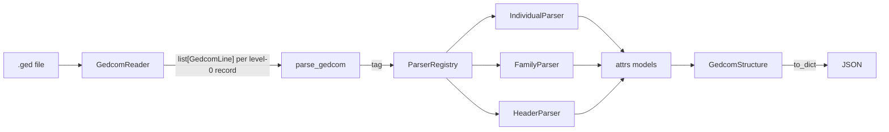

# Rootsy

A pythonic, fully typed GEDCOM parser.

Rootsy reads a `.ged` file and gives you immutable, well-typed Python objects
for every individual, family and supporting record, plus a one-call export to
plain JSON for use in web apps and other tools.

It exists because the Python GEDCOM parsers available when this project
started were either unmaintained, untyped, or stopped at "give me the raw tag
tree". Rootsy models the GEDCOM specification itself: fields are named after
what the spec says they mean, structures are parsed by dedicated parsers, and
nothing is stringly typed at the boundary.

## Status

Early, and honest about it. Parses `HEAD`, `INDI` and `FAM` from GEDCOM 5.5.1
exports well enough to drive a family-tree website, including events, dates and
family links; the other level-0 records and GEDCOM 7.0 are still to come. See
the roadmap below before relying on it.

## Install

Requires Python 3.13+.

```sh
uv add rootsy          # once published
# or, from a checkout
uv sync
```

## Usage

```python
from rootsy.parser import parse_gedcom

tree = parse_gedcom("family.ged")

print(tree.header.version)            # "5.5.1"
print(len(tree.individuals))          # people, keyed by xref, e.g. "@I12@"
print(len(tree.families))             # families, keyed by xref, e.g. "@F3@"

person = tree.individuals["@I12@"]
print(person.given_name, person.surname, person.sex)
print(person.child_of_families)       # FAMC: families they are a child of
print(person.spouse_in_families)      # FAMS: families they are a partner in

birth = person.birth                  # None when the record has no BIRT
print(birth.date.raw)                 # "ABT 1890", as written in the file
print(birth.date.year)                # 1890
print(birth.date.to_date())           # None: only exact dates convert

family = tree.families["@F3@"]
print(family.husband, family.wife, family.children)
print(family.marriage_event.date)     # "14 JUN 1919"
```

Export to JSON:

```python
import json
from pathlib import Path

Path("family.json").write_text(json.dumps(tree.to_dict(), indent=2))
```

The JSON mirrors the models:

```json
{
  "header": { "version": "5.5.1", "encoding": "UTF-8", "source": { "system_id": "MYHERITAGE" } },
  "individuals": {
    "@I12@": {
      "id": "@I12@", "given_name": "Ermes", "surname": "Rebecchi", "sex": "M",
      "events": [{ "type": "BIRT", "date": "ABT 1890", "place": "Verona" }],
      "child_of_families": [], "spouse_in_families": ["@F3@"]
    }
  },
  "families": {
    "@F3@": {
      "id": "@F3@", "husband": "@I12@", "wife": "@I13@", "children": ["@I20@"],
      "marriage_event": { "type": "MARR", "date": "14 JUN 1919" }
    }
  }
}
```

## Design



- **Reader**: streams the file, parses each line into `GedcomLine(level, xref,
  tag, value)`, and groups lines by level-0 record.
- **Registry**: discovers every parser class in `rootsy.parsers` and maps a
  GEDCOM tag to it, so adding a record type means adding one model and one
  parser, nothing else.
- **Parsers**: one per record or structure. Each consumes exactly its own
  lines and delegates nested structures (`ADDR`, events, …) to their parsers.
- **Models**: `attrs` frozen classes with slots and keyword-only fields.
  Immutable, hashable, and serialisable with `attrs.asdict`.

## Spec support

| Area | 5.5.1 | 7.0 |
| --- | --- | --- |
| Header (`HEAD`, `SOUR`, `CHAR`, `LANG`, `DATE`) | yes | planned |
| Individuals: names, sex, family links | yes | planned |
| Individual events (`BIRT`, `DEAT`, `RESI`) | yes | planned |
| Families: partners, children | yes | planned |
| Family events (`MARR`, `DIV`) | yes | planned |
| Addresses | yes | planned |
| Multimedia (`OBJE`) | minimal | planned |
| Sources, notes, repositories, submitters | no | planned |
| Qualified/partial dates (`ABT`, `BET … AND …`, `1890`) | yes | planned |
| Source citations on events | kept as raw lines | planned |
| Vendor extension tags (`_UID`, …) | kept on events | capture planned |

## Roadmap

1. Never lose data: unknown tags captured on every model, unknown level-0
   records skipped with a warning instead of crashing.
2. GEDCOM 7.0 with version detection, validated against the official sample
   files.
3. `rootsy export file.ged --out file.json` command-line interface; PyPI
   release.
4. Strict mypy and CI.

## Development

```sh
uv sync
uv run pytest
uv run ruff check . --fix && uv run ruff format .
```

Conventions and architecture notes for contributors (human or otherwise) are
in `CLAUDE.md`.

## References

- GEDCOM 5.5.1 specification (FamilySearch)
- GEDCOM 7.0 specification, https://gedcom.io
- Official GEDCOM 7 sample files, https://gedcom.io/tools/

## License

MIT
