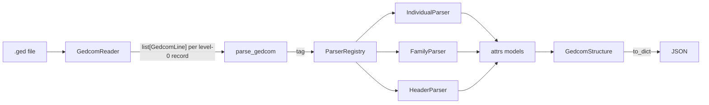

# Rootsy

A pythonic, fully typed GEDCOM parser.

Rootsy reads a `.ged` file and gives you immutable, well-typed Python objects
for every individual, family and supporting record, plus a one-call export to
plain JSON for use in web apps and other tools.

It exists because the Python GEDCOM parsers available when this project
started were either unmaintained, untyped, or stopped at "give me the raw tag
tree". Rootsy models the GEDCOM specification itself: fields are named after
what the spec says they mean, structures are parsed by dedicated parsers, and
nothing is stringly typed at the boundary.

## Status

Early, and honest about it. Parses `HEAD`, `INDI`, `FAM` and `SOUR` from
GEDCOM 5.5.1 exports well enough to drive a family-tree website, including
events, dates, family links, photos and the vendor tags MyHeritage writes; the
remaining level-0 records and GEDCOM 7.0 are still to come. See the roadmap
below before relying on it.

## Install

Requires Python 3.14+.

```sh
uv add rootsy          # once published
# or, from a checkout
uv sync
```

Installing the package puts a `rootsy` command on your path.

## Usage

### Command line

```sh
rootsy export family.ged --out family.json      # write the file as JSON
rootsy export family.ged --out family.json --indent 0   # one line, no indenting
rootsy export family.ged --out safe.json --anonymise    # …with nobody named
rootsy stats family.ged                         # what rootsy found in the file
rootsy coverage family.ged                      # what rootsy has no field for yet
```

`export` writes the same JSON as `to_dict()` below, indented by two spaces
unless `--indent` says otherwise. `stats` prints how many individuals, families
and sources were read, and how many level-0 records rootsy has no parser for:

```
family.ged
┏━━━━━━━━━━━━━┳━━━━━━━┓
┃ Records     ┃ Count ┃
┡━━━━━━━━━━━━━╇━━━━━━━┩
│ Individuals │   142 │
│ Families    │    56 │
│ Sources     │     3 │
│ Skipped     │     4 │
└─────────────┴───────┘
Skipped: NOTE x3, REPO x1
```

`coverage` goes the other way: it counts the lines each parser kept in
`unparsed` because no field of the model holds them, grouped by record type and
by the tags they sit under, plus the level-0 records no parser claimed. What
comes out is the list of tags your files actually contain, in the order it is
worth modelling them:

```
family.ged
61 unparsed lines, 5 records skipped
INDI: 54 unparsed lines in 24 of 24 records
┏━━━━━━━━━━━━━━━━━━━━┳━━━━━━━┳━━━━━━━━━━━━━━━━━━━━━━━━━━┓
┃ Tag path           ┃ Count ┃                          ┃
┡━━━━━━━━━━━━━━━━━━━━╇━━━━━━━╇━━━━━━━━━━━━━━━━━━━━━━━━━━┩
│ INDI > CHAN        │    16 │ ████████████████████████ │
│ INDI > CHAN > DATE │    16 │ ████████████████████████ │
│ INDI > ASSO        │    11 │ ████████████████         │
│ INDI > ASSO > RELA │    11 │ ████████████████         │
└────────────────────┴───────┴──────────────────────────┘
Skipped: level-0 records no parser claimed
┏━━━━━━┳━━━━━━━┳━━━━━━━━━━━━━━━━━━━━━━━━━━┓
┃ Tag  ┃ Count ┃                          ┃
┡━━━━━━╇━━━━━━━╇━━━━━━━━━━━━━━━━━━━━━━━━━━┩
│ NOTE │     3 │ ████████████████████████ │
│ REPO │     1 │ ████████                 │
│ SUBM │     1 │ ████████                 │
└──────┴───────┴──────────────────────────┘
```

A path is built from the lines themselves, so a tag nested under another
unparsed tag reads as `INDI > CHAN > DATE`. A parent the parser did read, such
as the `DATE` above a `TIME`, is not in the list and so is not in the path.

`--anonymise` (or `--anonymize`) replaces every personal detail before writing;
`--dates keep|year|remove` says how much of each date to keep, the default
being the year alone. Every command reports a file it cannot read on stderr
and exits with a non-zero status.

### Python

```python
from rootsy.parser import parse_gedcom

tree = parse_gedcom("family.ged")

print(tree.header.version)            # "5.5.1"
print(len(tree.individuals))          # people, keyed by xref, e.g. "@I12@"
print(len(tree.families))             # families, keyed by xref, e.g. "@F3@"

person = tree.individuals["@I12@"]
print(person.given_name, person.surname, person.sex)
print(person.child_of_families)       # FAMC: families they are a child of
print(person.spouse_in_families)      # FAMS: families they are a partner in
print(person.occupations)             # OCCU, in the order the file writes them
print(person.uid)                     # _UID: the same person in the next export

photo = person.primary_photo          # the OBJE marked _PRIM, else the first
print(photo.file, photo.title)        # "photos/giovanni.jpg" "In uniform"
print(photo.date.raw, photo.place)    # when and where it was taken, if known
print(photo.vendor)                   # {"_CUTOUT": "Y", …}: tags left as text

birth = person.birth                  # None when the record has no BIRT
print(birth.date.raw)                 # "ABT 1890", as written in the file
print(birth.date.year)                # 1890
print(birth.date.to_date())           # None: only exact dates convert

family = tree.families["@F3@"]
print(family.husband, family.wife, family.children)
print(family.marriage_event.date)     # "14 JUN 1919"
```

### Finding what is not modelled yet

`coverage` is the same report as the command, as typed objects:

```python
from rootsy.coverage import coverage
from rootsy.parser import parse_gedcom

report = coverage(parse_gedcom("family.ged"))

print(report.unparsed_lines)                  # 61
for group in report.records:                  # INDI, FAM, HEAD, SOUR: worst first
    print(group.tag, group.lines, group.records_with_unparsed, group.records)
    for path in group.paths:                  # most frequent path first
        print(path, path.count)               # "INDI > CHAN > DATE" 16

print([(str(tag), tag.count) for tag in report.skipped])  # [("NOTE", 3), …]
```

### Anonymising a file

A family file is mostly information about living people, so it cannot be
attached to a bug report or committed as a test fixture as it is. `anonymise`
returns a copy that keeps the shape of the tree and loses the people in it:

```python
from rootsy.anonymise import AnonymisationPolicy, DatePolicy, anonymise
from rootsy.parser import parse_gedcom

safe = anonymise(parse_gedcom("family.ged"))

person = safe.individuals["@I1@"]
print(person.name)                    # "Given1 /Surname1/"
print(person.birth.date.raw)          # "1890": the year, not "ABT 12 MAR 1890"
print(person.birth.place)             # "Place1"
print(safe.families["@F1@"].children) # ["@I3@"]: the tree still holds together

# Keep less, or keep more
anonymise(tree, AnonymisationPolicy(dates=DatePolicy.REMOVE))   # no dates at all
anonymise(tree, AnonymisationPolicy(keep_places=True))          # real place names
anonymise(tree, AnonymisationPolicy(keep_xrefs=True))           # original @I500123@
```

Names, places, notes, emails, addresses, occupations, photo paths and titles,
stable ids, source titles and the value of every tag rootsy does not model are
replaced; two people who shared a surname still share one, and a place named
twice is named twice. What says how the file was
written - the exporting software, the GEDCOM version, the tags each record
carries - is kept, because that is the reason to hold on to an anonymised file.

Export to JSON:

```python
import json
from pathlib import Path

Path("family.json").write_text(json.dumps(tree.to_dict(), indent=2))
```

The JSON mirrors the models:

```json
{
  "header": { "version": "5.5.1", "encoding": "UTF-8", "source": { "system_id": "MYHERITAGE" } },
  "individuals": {
    "@I12@": {
      "id": "@I12@", "given_name": "Ermes", "surname": "Rebecchi", "sex": "M",
      "events": [{ "type": "BIRT", "date": "ABT 1890", "place": "Verona" }],
      "media": [{ "file": "photos/ermes.jpg", "primary": true }],
      "occupations": ["Contadino"], "uid": "4F2C1A", "vendor": { "RIN": "12" },
      "child_of_families": [], "spouse_in_families": ["@F3@"]
    }
  },
  "families": {
    "@F3@": {
      "id": "@F3@", "husband": "@I12@", "wife": "@I13@", "children": ["@I20@"],
      "marriage_event": { "type": "MARR", "date": "14 JUN 1919" }
    }
  },
  "skipped": [{ "tag": "REPO", "xref": "@R1@", "line_number": 412 }]
}
```

`skipped` names the level-0 records rootsy has no parser for yet, with the line
each one started at, so nothing disappears without saying so.

## Design



- **Reader**: streams the file, parses each line into `GedcomLine(level, xref,
  tag, value)`, and groups lines by level-0 record.
- **Registry**: discovers every parser class in `rootsy.parsers` and maps a
  GEDCOM tag to it, so adding a record type means adding one model and one
  parser, nothing else.
- **Parsers**: one per record or structure. Each consumes exactly its own
  lines and delegates nested structures (`ADDR`, events, …) to their parsers.
- **Models**: `attrs` frozen classes with slots and keyword-only fields.
  Immutable, hashable, and serialisable with `attrs.asdict`.

## Spec support

| Area | 5.5.1 | 7.0 |
| --- | --- | --- |
| Header (`HEAD`, `SOUR`, `CHAR`, `LANG`, `DATE`) | yes | planned |
| Individuals: names, sex, family links | yes | planned |
| Name pieces (`GIVN`, `SURN`, `NPFX`, `_MARNM`) | yes | planned |
| Individual events (`BIRT`, `DEAT`, `BURI`, `RESI`) | yes | planned |
| Individual attributes (`OCCU`, `NOTE`) | yes | planned |
| Families: partners, children | yes | planned |
| Family events (`MARR`, `DIV`, `EVEN` with `TYPE`) | yes | planned |
| Event detail (`DATE`, `PLAC`, `CAUS`, `AGE`, `EMAIL`, `ADDR`) | yes | planned |
| Addresses | yes | planned |
| Multimedia (`OBJE`) on a record | yes | planned |
| Sources: title, author, publication, text | yes | planned |
| Notes, repositories, submitters as level-0 records | no | planned |
| Qualified/partial dates (`ABT`, `BET … AND …`, `1890`) | yes | planned |
| Source citations on events and individuals | kept as raw lines | planned |
| Stable ids (`_UID`) and exporter fields (`RIN`, `_UPD`) | yes | planned |
| Photo vendor tags (`_PRIM`, `_DATE`, `_PLACE`, `_CUTOUT`, …) | yes | n/a |
| Other vendor extension tags | kept on the record | kept on the record |

Anonymisation covers every record and structure the parser produces, so a new
field is anonymised as soon as it is parsed.

## Roadmap

1. Never lose data: unknown tags captured on every model, unknown level-0
   records skipped with a warning instead of crashing. Done.
2. `rootsy export` and `rootsy stats`, strict mypy and CI. Done.
3. GEDCOM 7.0 with version detection, validated against the official sample
   files.
4. Parsers for the remaining level-0 records (`NOTE`, `SUBM`, `REPO`) and a
   source citation model.
5. PyPI release.

## Development

```sh
uv sync
uv run pytest
uv run ruff check . --fix && uv run ruff format .
uv run mypy
```

The same four checks run in CI on every push and pull request.

Conventions and architecture notes for contributors (human or otherwise) are
in `CLAUDE.md`.

## References

- GEDCOM 5.5.1 specification (FamilySearch)
- GEDCOM 7.0 specification, https://gedcom.io
- Official GEDCOM 7 sample files, https://gedcom.io/tools/

## License

MIT
